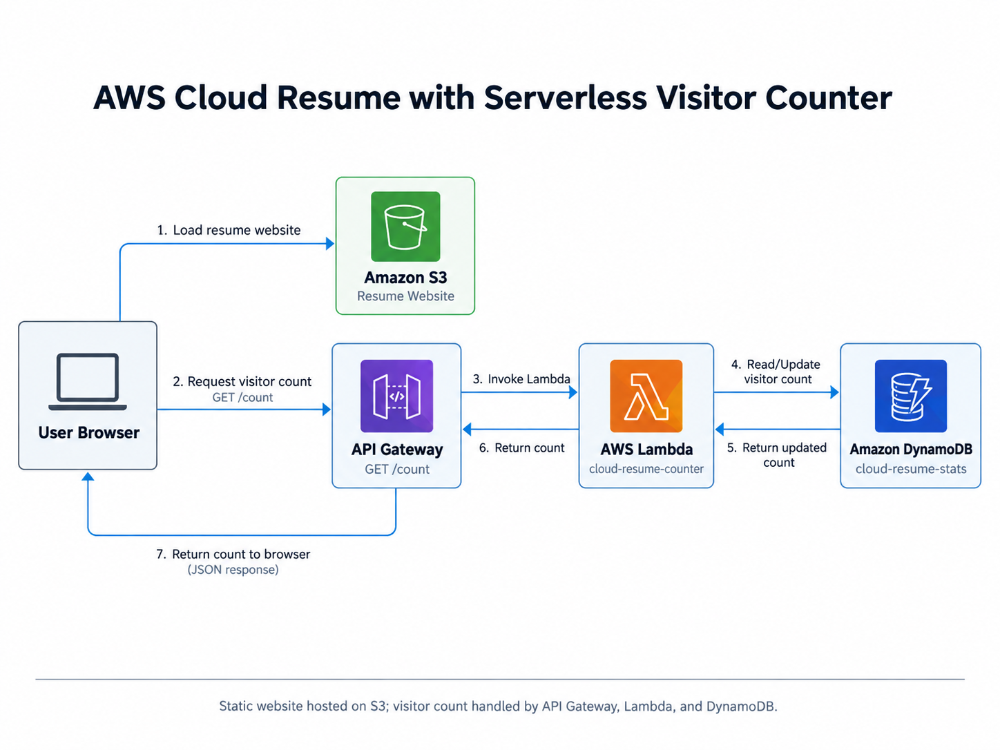
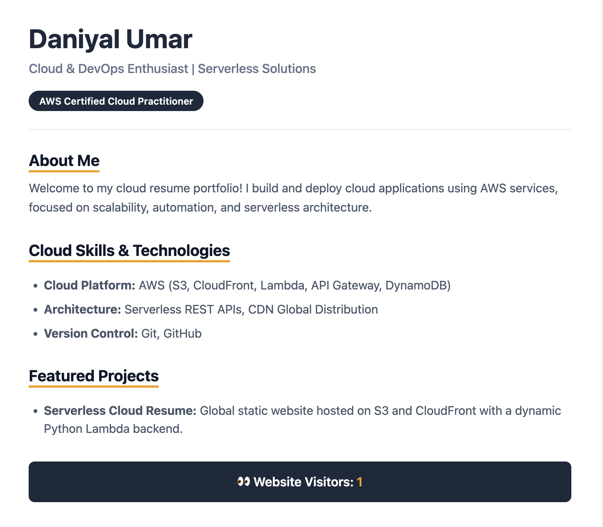
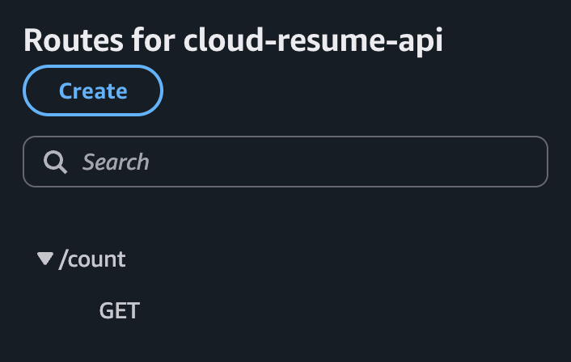
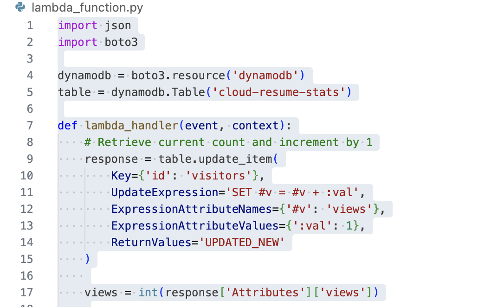
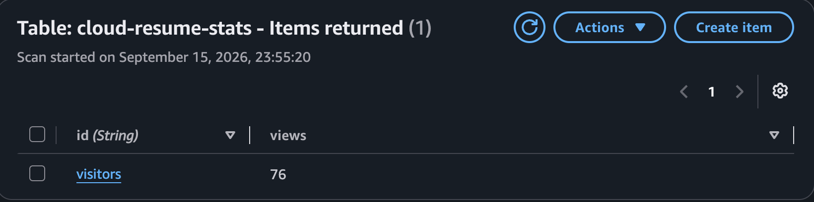
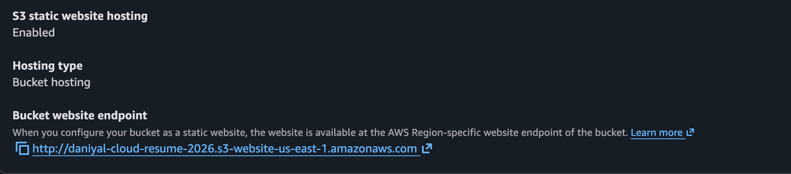

# AWS Cloud Resume with Serverless Visitor Counter

A cloud-hosted resume website built on AWS with a live visitor counter. The frontend is hosted on Amazon S3, while API Gateway, AWS Lambda, and DynamoDB handle visitor tracking.

## Architecture

## AWS Services Used

•⁠  ⁠Amazon S3
•⁠  ⁠Amazon API Gateway
•⁠  ⁠AWS Lambda
•⁠  ⁠Amazon DynamoDB

## How It Works

1.⁠ ⁠The resume website is served from Amazon S3.
2.⁠ ⁠When the page loads, JavaScript sends a request to API Gateway using the ⁠ GET /count ⁠ route.
3.⁠ ⁠API Gateway invokes the ⁠ cloud-resume-counter ⁠ Lambda function.
4.⁠ ⁠The Lambda function increments the visitor count stored in the ⁠ cloud-resume-stats ⁠ DynamoDB table.
5.⁠ ⁠The updated count is returned to the browser as JSON and displayed on the page.

## Project Files

•⁠  ⁠⁠ index.html ⁠ — resume website frontend
•⁠  ⁠⁠ lambda_function.py ⁠ — Python Lambda function for visitor tracking
•⁠  ⁠⁠ architecture-diagram.png ⁠ — project architecture
•⁠  ⁠⁠ live-website.png ⁠ — live resume website
•⁠  ⁠⁠ api-route.png ⁠ — API Gateway route
•⁠  ⁠⁠ lambda-code.png ⁠ — Lambda implementation
•⁠  ⁠⁠ S3-hosting.png ⁠ — S3 static website hosting
•⁠  ⁠⁠ dynamodb-counter.png ⁠ — DynamoDB visitor record

## Screenshots

### Live Resume Website

### API Gateway Route

### Lambda Function

### DynamoDB Visitor Counter

### S3 Static Website Hosting

## What I Learned

•⁠  ⁠Hosting a static website on Amazon S3
•⁠  ⁠Connecting a frontend to a serverless API
•⁠  ⁠Using API Gateway with AWS Lambda
•⁠  ⁠Updating DynamoDB from Lambda with Boto3
•⁠  ⁠Returning JSON responses to the browser
•⁠  ⁠Configuring CORS for browser requests

## Tech Stack

•⁠  ⁠HTML
•⁠  ⁠JavaScript
•⁠  ⁠Python
•⁠  ⁠Boto3
•⁠  ⁠Amazon S3
•⁠  ⁠Amazon API Gateway
•⁠  ⁠AWS Lambda
•⁠  ⁠Amazon DynamoDB
